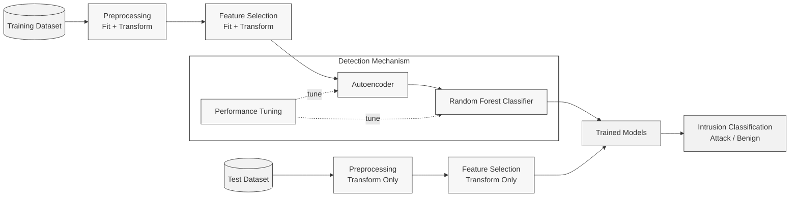
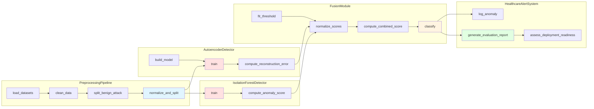
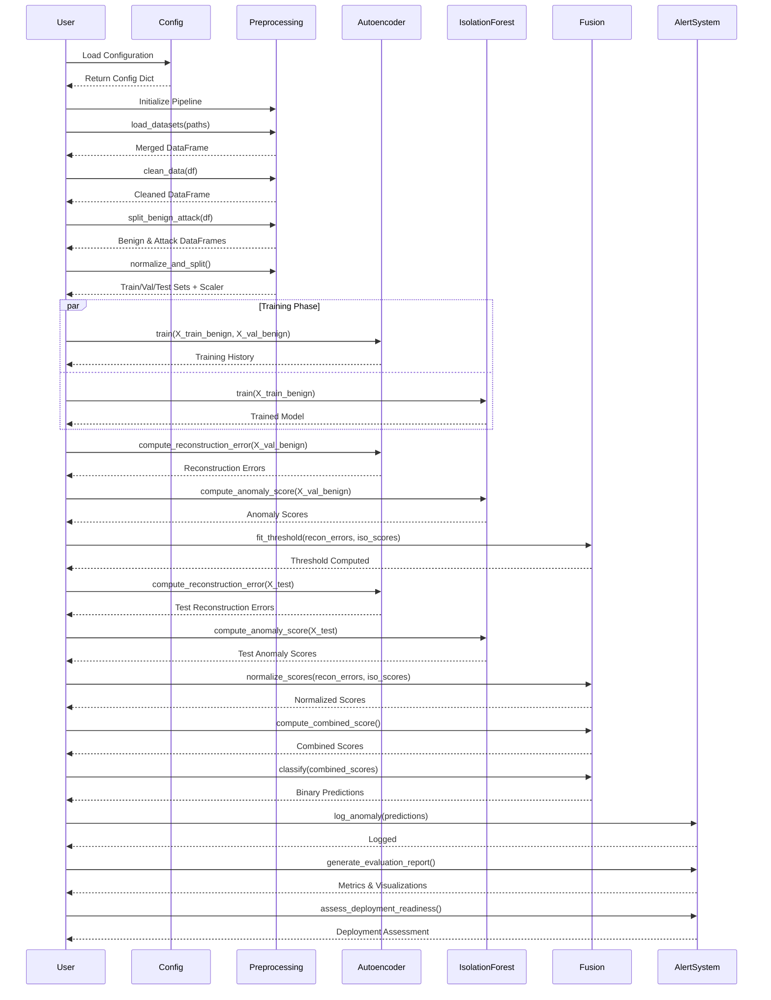
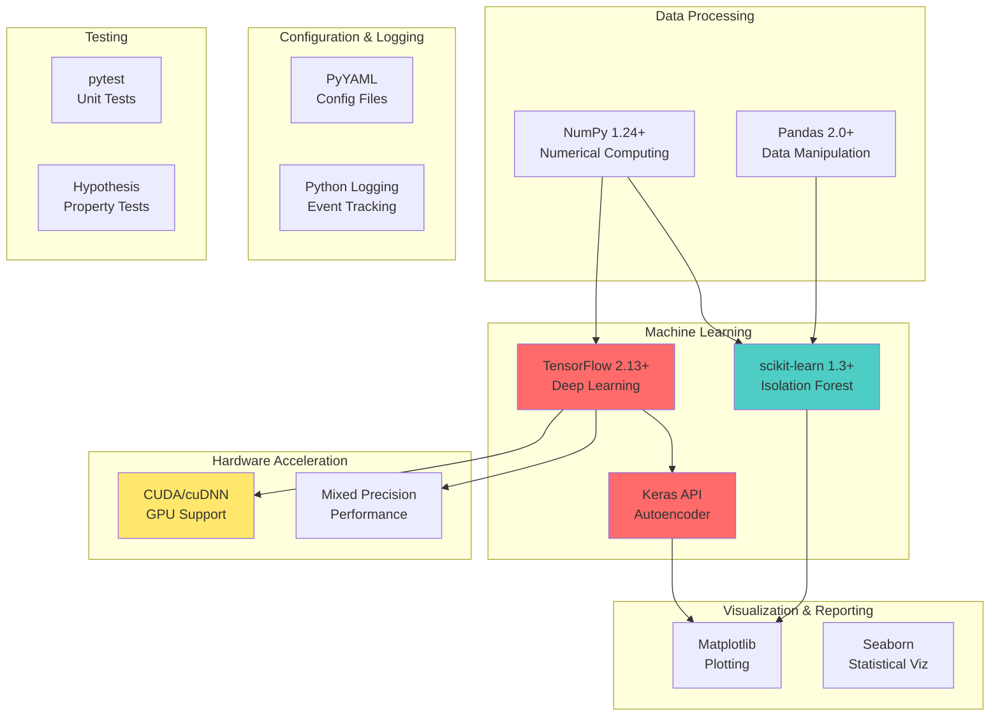
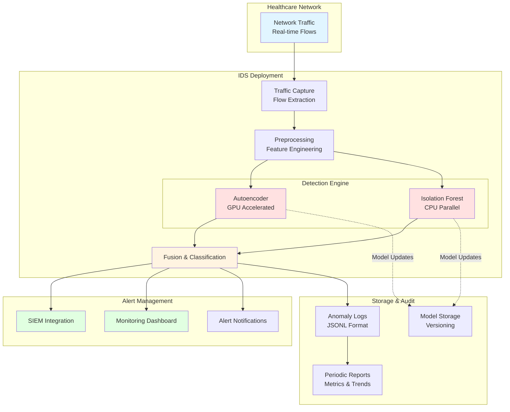

# System Architecture Diagram

## Hybrid Anomaly-Based IDS for Healthcare Networks

This document contains the system architecture diagrams for the Hybrid IDS project.

## High-Level System Architecture



### High-Level Notes

- **Training vs test flow**: Training data uses **fit + transform** for preprocessing/feature selection, while test data uses **transform only** (same fitted pipeline, no re-fitting).
- **Model usage on test data**: Test data is transformed with the same fitted preprocessing/feature pipeline, then uses the **Trained Models** artifact for inference-only prediction.
- **Classifier naming**: `Random Forest Classifier` is used as an explicit label; `Classifier` is also valid, but this is clearer for reports.
- **Performance Tuning role**: The dashed links indicate an iterative development loop where validation feedback is used to tune feature count, autoencoder architecture, classifier hyperparameters, and thresholds before final evaluation/deployment.

## Detailed Component Architecture



## Data Flow Architecture

```mermaid
flowchart TD
    Start([Raw Network Flow Data]) --> Load[Load & Merge Datasets]
    Load --> Clean[Clean Data<br/>Remove Duplicates/NaN/Inf]
    Clean --> Filter[Filter Numeric Features]
    Filter --> Split1{Split by Label}
    
    Split1 -->|BENIGN| Benign[Benign Samples]
    Split1 -->|ATTACK| Attack[Attack Samples]
    
    Benign --> Norm[StandardScaler<br/>Fit on Benign]
    Attack --> Norm
    
    Norm --> Split2{Stratified Split}
    
    Split2 -->|70% Benign| Train[Training Set<br/>Benign Only]
    Split2 -->|20% Benign| Val[Validation Set<br/>Benign Only]
    Split2 -->|30% Mixed| Test[Test Set<br/>Benign + Attacks]
    
    Train --> AE_Train[Train Autoencoder]
    Train --> IF_Train[Train Isolation Forest]
    Val --> AE_Train
    Val --> IF_Train
    
    AE_Train --> AE_Model[Autoencoder Model]
    IF_Train --> IF_Model[Isolation Forest Model]
    
    Test --> AE_Infer[Compute Reconstruction Error]
    Test --> IF_Infer[Compute Anomaly Score]
    
    AE_Model --> AE_Infer
    IF_Model --> IF_Infer
    
    Val --> Threshold[Compute Dynamic Threshold<br/>95th/99th Percentile]
    
    AE_Infer --> Normalize[Normalize Scores<br/>Min-Max [0,1]]
    IF_Infer --> Normalize
    
    Normalize --> Combine[Weighted Combination<br/>w_ae × recon + w_if × iso]
    Threshold --> Classify{Score > Threshold?}
    Combine --> Classify
    
    Classify -->|Yes| Anomaly[Anomaly: 1]
    Classify -->|No| Normal[Benign: 0]
    
    Anomaly --> Alert[Healthcare Alert System]
    Normal --> Alert
    
    Alert --> Metrics[Compute Metrics<br/>FPR, Recall, F1, ROC-AUC]
    Alert --> Log[Log Anomalies]
    Alert --> Report[Generate Reports]
    
    Metrics --> End([Deployment Assessment])
    
    style Train fill:#ffe1e1
    style Val fill:#ffe1e1
    style Test fill:#fff4e1
    style AE_Model fill:#ffcccc
    style IF_Model fill:#ffcccc
    style Alert fill:#e1ffe1
```

## Module Interaction Sequence



## Technology Stack



## Deployment Architecture



## Key Design Principles

1. **Benign-Only Training**: All models train exclusively on normal traffic to enable true anomaly detection
2. **Hybrid Detection**: Combines reconstruction-based (Autoencoder) and isolation-based (Isolation Forest) approaches
3. **Dynamic Thresholding**: Uses percentile-based thresholds from benign validation distribution
4. **Healthcare Optimization**: Prioritizes low false positive rates (<5%) for clinical deployment
5. **Modularity**: Clear separation of concerns for testing, debugging, and extension
6. **Scalability**: Supports both batch processing and streaming inference
7. **Reproducibility**: Fixed random seeds and deterministic operations
8. **Zero-Day Detection**: Capable of detecting novel attack patterns not seen during training
